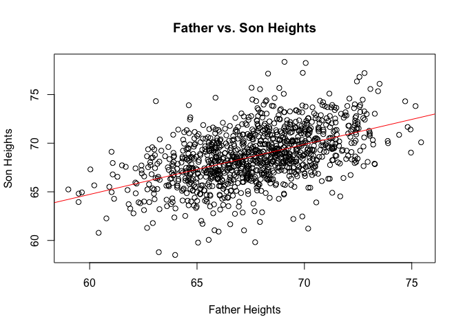
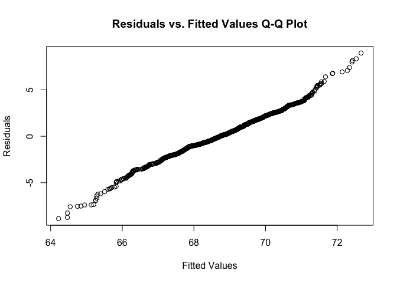
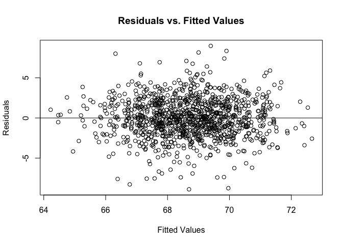
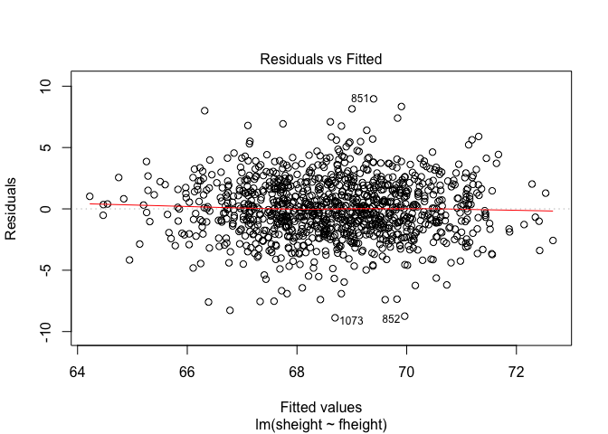
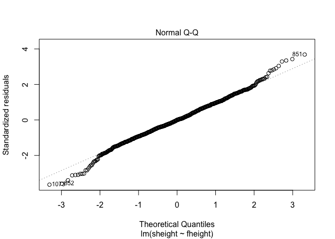
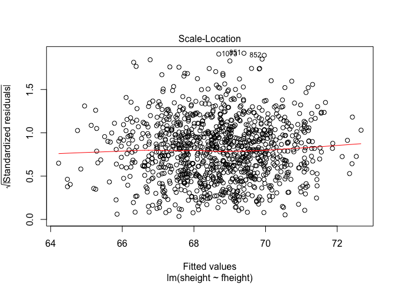
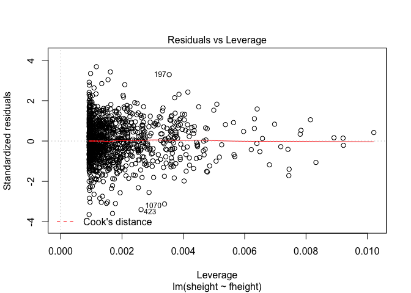
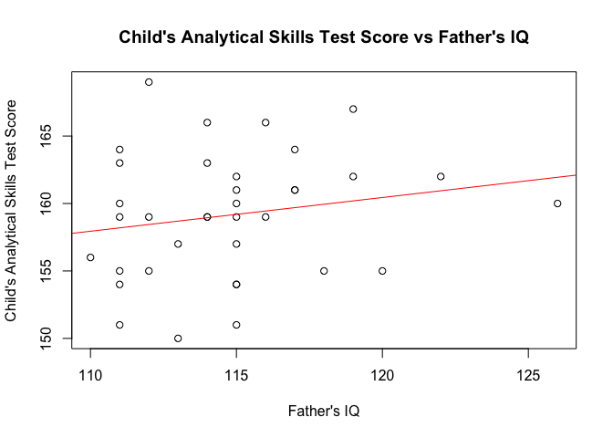
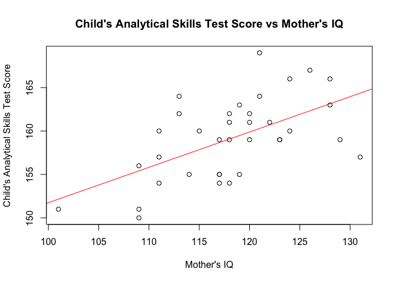

A Review of Statistics and Probability Fundamentals
================
Timothy Pace
2/11/2017

In 2013, the Pew Research Foundation reported that “45% of U.S. adults report that they live with one or more chronic conditions”. However, this value was based on a sample, so it may not be a perfect estimate for the population parameter of interest on its own. The study reported a standard error of about 1.2%, and a normal model may reasonably be used in this setting. Create a 95% confidence interval for the proportion of U.S. adults who live with one or more chronic conditions. Also interpret the confidence interval in the context of the study.
-------------------------------------------------------------------------------------------------------------------------------------------------------------------------------------------------------------------------------------------------------------------------------------------------------------------------------------------------------------------------------------------------------------------------------------------------------------------------------------------------------------------------------------------------------------------------

``` r
SE <- 0.012
p_hat <- 0.45
Z <- 1.96

upper <- p_hat + Z * SE
lower <- p_hat - Z * SE

upper
```

    ## [1] 0.47352

``` r
lower
```

    ## [1] 0.42648

(95% CI: 0.42648, 0.47352)

We are 95% confident that the true proportion of U.S. adults who live with one or more chronic conditions is within (0.42648, 0.47352).

In other words, if we take many samples, 95% of the time we repeat this process, our confidence intervals will contain the true proportion of U.S. adults who live with one or more chronic conditions.

The nutrition label on a bag of potato chips says that a one ounce (28 gram) serving of potato chips has 130 calories and contains ten grams of fat, with three grams of saturated fat. A random sample of 35 bags yielded a sample mean of 136 calories with a standard deviation of 17 calories. Write down the null and alternative hypotheses for a two-sided test of whether the nutrition label is lying.
---------------------------------------------------------------------------------------------------------------------------------------------------------------------------------------------------------------------------------------------------------------------------------------------------------------------------------------------------------------------------------------------------------------

Null Hypothesis:

The mean calories of a one ounce bag of potato chips is equal to 130 calories and the nutrition label is not lying.

*μ* = 130

Alternate Hypothesis:

The mean calories of a one ounce bag of potato chips is not equal to 130 calories and the nutrition label is lying.

*μ* ≠ 130

Calculate the test statistic and find the p value.
$$ \\frac{\\bar{X} - \\mu}{\\sigma\_{\\bar{X}}}$$

``` r
n <- 35
x_bar <- 136
mu <- 130
std_dev <- 17

test_s <- (x_bar - mu) / (std_dev/sqrt(35))
test_s
```

    ## [1] 2.088028

``` r
upper_tail <- pnorm(test_s, lower.tail = F)
lower_tail <- pnorm(-test_s, lower.tail = T)

p_value <- lower_tail + lower_tail
p_value
```

    ## [1] 0.03679529

The test statistic is: 2.088028. The p-value is: 0.03679529.

If you were the potato chip company would you rather have your alpha = 0.05 or 0.025 in this case? Why?
-------------------------------------------------------------------------------------------------------

If you were the potato chip company in this case, you would rather have your alpha equal to 0.025, because if the alpha is equal to 0.05, we reject the null hypothesis (*p* &lt; 0.05), indicating that the nutrition label is lying. However, if we set an alpha equal to 0.025, we fail to reject the null hypothesis that the nutrition label isn't lying (*p* &gt; 0.025), thereby benefiting the potato chip company.

The potato chip company would also want an alpha equal to 0.025 because, for a two-tailed test, you divide the alpha by two for each tail. Therefore, if an alpha of 0.025 is used, a p-value of less than 0.0125 is required in each tail, which would make it harder to obtain statistical significance. This is a good thing for the potato chip company, as it would be beneficial to increase the likelihood of committing a type II error.

Regression was originally used by Francis Galton to study the relationship between parents and children. He wondered if he could predict a man’s height based on the height of his father? This is the question we will explore in this problem. You can obtain data similar to that used by Galton as follows:
---------------------------------------------------------------------------------------------------------------------------------------------------------------------------------------------------------------------------------------------------------------------------------------------------------------

``` r
#install.packages("UsingR")
library(UsingR)
```

    ## Loading required package: MASS

    ## Loading required package: HistData

    ## Loading required package: Hmisc

    ## Loading required package: lattice

    ## Loading required package: survival

    ## Loading required package: Formula

    ## Loading required package: ggplot2

    ## 
    ## Attaching package: 'Hmisc'

    ## The following objects are masked from 'package:base':
    ## 
    ##     format.pval, units

    ## 
    ## Attaching package: 'UsingR'

    ## The following object is masked from 'package:survival':
    ## 
    ##     cancer

``` r
height <- get("father.son")
```

### Perform an exploratory analysis of the father and son heights. What does the relationship look like? Would a linear model be appropriate here?

``` r
dim(height)
```

    ## [1] 1078    2

``` r
str(height)
```

    ## 'data.frame':    1078 obs. of  2 variables:
    ##  $ fheight: num  65 63.3 65 65.8 61.1 ...
    ##  $ sheight: num  59.8 63.2 63.3 62.8 64.3 ...

``` r
summary(height)
```

    ##     fheight         sheight     
    ##  Min.   :59.01   Min.   :58.51  
    ##  1st Qu.:65.79   1st Qu.:66.93  
    ##  Median :67.77   Median :68.62  
    ##  Mean   :67.69   Mean   :68.68  
    ##  3rd Qu.:69.60   3rd Qu.:70.47  
    ##  Max.   :75.43   Max.   :78.36

``` r
cor(height)
```

    ##           fheight   sheight
    ## fheight 1.0000000 0.5013383
    ## sheight 0.5013383 1.0000000

``` r
plot(height$sheight ~ height$fheight, xlab = "Father Heights", ylab = "Son Heights", 
     main = "Father vs. Son Heights")
```


The relationship is positive and increasing. In other words, there is a positive association between father and son heights, with son heights increasing in association with father heights.

A linear model would be appropriate here, as the correlation is moderately positive (r = 0.50), and data appears to be linearly shaped when plotted.

### Fit a simple linear regression model to predict son's height as a function of father's height. Write down the model, ysheight = B0 + B1 x fheight filling in estimated coefficient values and interpret the coefficient estimates.

``` r
sheight_model <- lm(sheight ~ fheight, data = height)
summary(sheight_model)
```

    ## 
    ## Call:
    ## lm(formula = sheight ~ fheight, data = height)
    ## 
    ## Residuals:
    ##     Min      1Q  Median      3Q     Max 
    ## -8.8772 -1.5144 -0.0079  1.6285  8.9685 
    ## 
    ## Coefficients:
    ##             Estimate Std. Error t value Pr(>|t|)    
    ## (Intercept) 33.88660    1.83235   18.49   <2e-16 ***
    ## fheight      0.51409    0.02705   19.01   <2e-16 ***
    ## ---
    ## Signif. codes:  0 '***' 0.001 '**' 0.01 '*' 0.05 '.' 0.1 ' ' 1
    ## 
    ## Residual standard error: 2.437 on 1076 degrees of freedom
    ## Multiple R-squared:  0.2513, Adjusted R-squared:  0.2506 
    ## F-statistic: 361.2 on 1 and 1076 DF,  p-value: < 2.2e-16

ysheight = *β*<sub>0</sub> + *β*<sub>1</sub> x fheight

ysheight = 33.88660 + 0.51409 x fheight

B1: A 1 inch increase in father height is associated with an expected increase of 0.51409 inches in son height.

B0: A father of height 0 would be expected to have a son with a height of 33.88660 inches.

### Find the 95% confidence intervals for the estimates. You may find the confint() command useful.

``` r
confint(sheight_model, level = 0.95)
```

    ##                  2.5 %     97.5 %
    ## (Intercept) 30.2912126 37.4819961
    ## fheight      0.4610188  0.5671673

0.51409 (95% CI: 0.4610188, 0.5671673).

### Produce a visualization of the data and the least squares regression line.

``` r
plot(height$sheight ~ height$fheight, xlab = "Father Heights", ylab = "Son Heights", 
     main = "Father vs. Son Heights")
abline(sheight_model, col = "red")
```



### Produce a visualization of the residuals versus the fitted values. Discuss what you see. Do you have any concerns about the linear model?

``` r
names(sheight_model)
```

    ##  [1] "coefficients"  "residuals"     "effects"       "rank"         
    ##  [5] "fitted.values" "assign"        "qr"            "df.residual"  
    ##  [9] "xlevels"       "call"          "terms"         "model"

``` r
qqplot(sheight_model[["fitted.values"]], sheight_model[["residuals"]], 
       xlab = "Fitted Values", 
       ylab = "Residuals", 
       main = "Residuals vs. Fitted Values Q-Q Plot")
```



``` r
plot(sheight_model[["residuals"]] ~ sheight_model[["fitted.values"]],
      xlab = "Fitted Values", 
       ylab = "Residuals", 
       main = "Residuals vs. Fitted Values")
abline(h = 0)
```



``` r
plot(sheight_model)
```



On the Q-Q plot, the distribution of the residuals is generally normal and falls on a straight line. However, the distribution of the residuals is not necessarily normal in the quantiles below -2 and above 2, and the tails of the residuals distribution may be slightly non-normal. With that said, there is little data in the tails of the distribution, so it is difficult to tell. Therefore, the linear model mostly meets the assumption of normal residuals.

In the Residuals vs Fitted values plot, the variability of the points around the least squares line remains roughly constant. Because the line is more or less flat, the pattern is homoscedastic, and the linear model therefore meets the assumption of constant variability.

We therefore have no major concerns about the linear model.

### Using the model you fit in part (b) predict the height was 5 males whose father are 50, 55, 70, 75, and 90 inches respectively.

``` r
predict(sheight_model, newdata = data.frame("fheight" = c(50, 55, 70, 75, 90)),
        interval = "prediction")
```

    ##        fit      lwr      upr
    ## 1 59.59126 54.71685 64.46566
    ## 2 62.16172 57.33140 66.99204
    ## 3 69.87312 65.08839 74.65785
    ## 4 72.44358 67.64470 77.24246
    ## 5 80.15498 75.22740 85.08255

The predicted heights are (father height: expected son height): 50: 59.59126, 55: 62.16172 , 70: 69.87312 , 75: 72.44358, 90: 80.15498.

### What do the estimates of the slope and height mean? Are the results statistically significant? Are they practically significant?

A 1 inch increase in father height is associated with an expected increase of 0.51409 inches in son height. Moreover, a father of height 0 would be expected to have a son with a height of 33.88660 inches.

The results for the estimates of the slope of height are statistically significant, with a small p-value of 2.2e-16 (*p* &lt; 0.001).

It is practically significant that a father's height being higher would mean that a son's height is higher as well (e.g., due to genetics). However, there are many factors and confounding variables other than father's height that may be contributing to the son's height. For example, other factors that may be influencing son's height might include the mother's height, as well as enviromental variables such as proper nutrition and disease. Moreover, the adjusted r-squared is 0.2506, meaning that only 0.25 of the variability in the son's height is explained by the father's height.

### An investigator is interested in understanding the relationship, if any, between the analytical skills of young gifted children and the father's IQ, the mother's IQ, and hours of educational TV. The data are here:

``` r
#install.packages("openintro")
library(openintro)
```

    ## Please visit openintro.org for free statistics materials

    ## 
    ## Attaching package: 'openintro'

    ## The following object is masked from 'package:UsingR':
    ## 
    ##     babies

    ## The following object is masked from 'package:ggplot2':
    ## 
    ##     diamonds

    ## The following object is masked from 'package:survival':
    ## 
    ##     transplant

    ## The following object is masked from 'package:lattice':
    ## 
    ##     lsegments

    ## The following objects are masked from 'package:MASS':
    ## 
    ##     housing, mammals

    ## The following objects are masked from 'package:datasets':
    ## 
    ##     cars, trees

``` r
data(gifted)
```

### Run two regressions: one with the child's analytical skills test score (“score”) and the father's IQ (“fatheriq”) and the child's score and the mother's IQ score (“motheriq”).

``` r
plot(gifted$score ~ gifted$fatheriq, xlab = "Father\'s IQ", 
     ylab = "Child\'s Analytical Skills Test Score", 
     main = "Child\'s Analytical Skills Test Score vs Father\'s IQ")

father_model <- lm(score ~ fatheriq, data = gifted)
abline(father_model, col = "red")
```



``` r
plot(gifted$score ~ gifted$motheriq, xlab = "Mother\'s IQ", 
     ylab = "Child\'s Analytical Skills Test Score", 
     main = "Child\'s Analytical Skills Test Score vs Mother\'s IQ")

mother_model <- lm(score ~ motheriq, data = gifted)
abline(mother_model, col = "red")
```



### What are the estimates of the slopes for father and mother's IQ score with their 95% confidence intervals? (Note, estimates and confidence intervals are usually reported: Estimate (95% CI: CIlower, CIupper)

``` r
summary(father_model)
```

    ## 
    ## Call:
    ## lm(formula = score ~ fatheriq, data = gifted)
    ## 
    ## Residuals:
    ##     Min      1Q  Median      3Q     Max 
    ## -8.6942 -3.2565  0.3058  2.0559 10.5559 
    ## 
    ## Coefficients:
    ##             Estimate Std. Error t value Pr(>|t|)    
    ## (Intercept) 130.4294    25.7226   5.071 1.39e-05 ***
    ## fatheriq      0.2501     0.2240   1.117    0.272    
    ## ---
    ## Signif. codes:  0 '***' 0.001 '**' 0.01 '*' 0.05 '.' 0.1 ' ' 1
    ## 
    ## Residual standard error: 4.614 on 34 degrees of freedom
    ## Multiple R-squared:  0.03537,    Adjusted R-squared:  0.007003 
    ## F-statistic: 1.247 on 1 and 34 DF,  p-value: 0.272

``` r
confint(father_model, level = 0.95)
```

    ##                  2.5 %      97.5 %
    ## (Intercept) 78.1548748 182.7039518
    ## fatheriq    -0.2051068   0.7053687

``` r
summary(mother_model)
```

    ## 
    ## Call:
    ## lm(formula = score ~ motheriq, data = gifted)
    ## 
    ## Residuals:
    ##     Min      1Q  Median      3Q     Max 
    ## -7.3569 -2.7497  0.1157  2.8794  8.7091 
    ## 
    ## Coefficients:
    ##             Estimate Std. Error t value Pr(>|t|)    
    ## (Intercept) 111.0930    11.8567   9.370 6.02e-11 ***
    ## motheriq      0.4066     0.1002   4.058 0.000274 ***
    ## ---
    ## Signif. codes:  0 '***' 0.001 '**' 0.01 '*' 0.05 '.' 0.1 ' ' 1
    ## 
    ## Residual standard error: 3.856 on 34 degrees of freedom
    ## Multiple R-squared:  0.3263, Adjusted R-squared:  0.3065 
    ## F-statistic: 16.47 on 1 and 34 DF,  p-value: 0.000274

``` r
confint(mother_model, level = 0.95)
```

    ##                  2.5 %      97.5 %
    ## (Intercept) 86.9972563 135.1886542
    ## motheriq     0.2029815   0.6102077

Father's IQ score slope estimate: 0.2501 (95% CI: -0.2051068, 0.7053687)

Mother's IQ score slope estimate: 0.4066 (95% CI: 0.2029815, 0.6102077)

### How are these interpreted?

A 1 point increase in the father's IQ score is associated with an expected increase of 0.2501 points on the child's analytical skills test score. With 95% confidence, the true value of the slope is within -0.2051068 and 0.7053687. If we repeated this experiment many times, the true slope of the linear model would be contained within our confidence intervals 95% of the time.

A 1 point increase in the mother's IQ score is associated with an expected increase of 0.4066 points in the child's analytical skills test score. With 95% confidence, the true value of the slope of the linear model is within -0.2051068 and 0.7053687. If we repeated this experiment many times, the true slope of the linear model would be contained within our confidence intervals 95% of the time.

### What conclusions can you draw about the association between the child's score and the mother and father's IQ?

The adjusted R-squared for the model of mother's IQ (0.3065) is greater than the adjusted R-squared of the model of father's IQ (0.007003) in association with childrens' analytical skills. Because mother's IQ has a higher adjusted R-squared, it explains more of the variation of the data and is more strongly associated with childrens' analytical skills test scores. Therefore, compared with father's IQ, the mother's IQ explains the childrens' score data best.

For each of the following situations, state whether the parameter of interest is a mean or a proportion. It may be helpful to examine whether individual responses are numerical or categorical.
------------------------------------------------------------------------------------------------------------------------------------------------------------------------------------------------

In a survey, one hundred college students are asked how many hours per week they spend on the Internet.

Mean

In a survey, one hundred college students are asked: “What percentage of the time you spend on the Internet is part of your course work?”

Mean

In a survey, one hundred college students are asked whether or not they cited information from Wikipedia in their papers.

Proportion

In a survey, one hundred college students are asked what percentage of their total weekly spending is on alcoholic beverages.

Mean

In a sample of one hundred recent college graduates, it is found that 85 percent expect to get a job within one year of their graduation date.

Proportion
