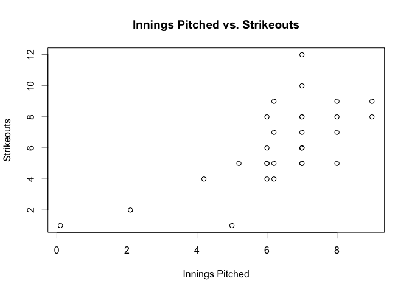
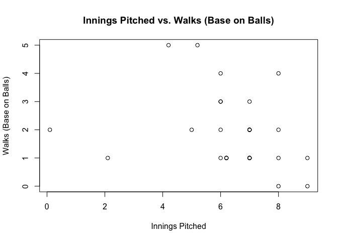
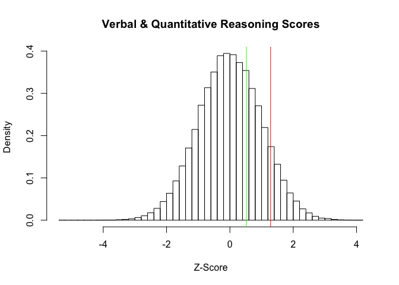

A Review of Statistics and Probability Fundamentals: Part 2
================
Timothy Pace
January 17, 2017

1. A 2012 Pew Research survey asked 2,373 randomly sampled registered voters their political affiliation (Republican, Democrat, or Independent) and whether or not they identify as swing voters. 35% of respondents identified as Independent, 23% identified as swing voters, and 11% identified as both.
-----------------------------------------------------------------------------------------------------------------------------------------------------------------------------------------------------------------------------------------------------------------------------------------------------------

### Are being Independent and being a swing voter disjoint, i.e. mutually exclusive?

No, being an Independent and being a swing voter are not disjoint, as there is a non-empty intersection.

### What percent of voters are Independent but not swing?

``` r
(.35 - .11) * 100
```

    ## [1] 24

### What percent of voters are Independent or swing voters?

``` r
(.35 + .23 - .11) * 100
```

    ## [1] 47

### What percent of voters are neither Independent nor swing voters?

``` r
(1 - (.35 + .23 - .11)) * 100
```

    ## [1] 53

### Is the event that someone is a swing voter independent of the event that someone is a political Independent?

No, the event of being a swing voter is not independent of the event that that someone is a political independent. Moreover, .35 \* .23 != .11.

2.
--

Loads the Felix Hernandez dataset in R.

``` r
felix <- read.csv("FelixHernandez2015.csv")
```

### How many wins does Felix have this year?

``` r
sum(felix$W)
```

    ## [1] 18

### What is the mean, median, and mode number of strikeouts Felix threw over the 2015 season?

``` r
Mode <- function(x) { ux <- unique(x)
  ux[which.max(tabulate(match(x, ux)))]
}

mean(felix$SO)
```

    ## [1] 6.16129

``` r
median(felix$SO)
```

    ## [1] 6

``` r
Mode(felix$SO)
```

    ## [1] 5

### Plots the relationship between innings pitched and strikeouts and between innings pitched and walks (base on balls).

``` r
plot(felix$IP, felix$SO, xlab = "Innings Pitched", ylab = "Strikeouts", 
     main = "Innings Pitched vs. Strikeouts")
```

 There is a moderate to strong increasing relationship between innings pitched and strikeouts.

``` r
plot(felix$IP, felix$BB, xlab = "Innings Pitched", ylab = "Walks (Base on Balls)",
     main = "Innings Pitched vs. Walks (Base on Balls)")
```

 There is a weak decreasing relationship between innings pitched and walks (base on balls).

### Calculates the correlation coefficient between innings pitched and strikeouts and between innings pitched and walks. Do these align with what you saw in the plots?

``` r
cor(felix$IP, felix$SO)
```

    ## [1] 0.6816081

Yes: there is a moderate to strong, positive correlation coefficient between innings pitched and strikeouts (0.68).

``` r
cor(felix$IP, felix$BB)
```

    ## [1] -0.2638496

Yes: there is a weak, negative correlation coefficient between innings pitched and walks (-0.26).

### Calculates the mean and variance of walks by month. Do you see changing mean walks over time? What about the variability over time? What might the pattern mean?

``` r
by(felix$BB, felix$Month, mean)
```

    ## felix$Month: Apr
    ## [1] 1.2
    ## -------------------------------------------------------- 
    ## felix$Month: Aug
    ## [1] 1
    ## -------------------------------------------------------- 
    ## felix$Month: Jul
    ## [1] 1.8
    ## -------------------------------------------------------- 
    ## felix$Month: Jun
    ## [1] 2.666667
    ## -------------------------------------------------------- 
    ## felix$Month: May
    ## [1] 1.8
    ## -------------------------------------------------------- 
    ## felix$Month: Sep
    ## [1] 2.6

Yes, I see changing mean walks over time. The mean number of walks seems to increase. It reaches a global maximum in June, and then decreases, reaching a minimum in August, and then increases again in September.

``` r
by(felix$BB, felix$Month, var)
```

    ## felix$Month: Apr
    ## [1] 0.7
    ## -------------------------------------------------------- 
    ## felix$Month: Aug
    ## [1] 0
    ## -------------------------------------------------------- 
    ## felix$Month: Jul
    ## [1] 0.7
    ## -------------------------------------------------------- 
    ## felix$Month: Jun
    ## [1] 1.866667
    ## -------------------------------------------------------- 
    ## felix$Month: May
    ## [1] 1.7
    ## -------------------------------------------------------- 
    ## felix$Month: Sep
    ## [1] 3.8

Yes, I see increasing variability over time. Variability reaches a maximum in June, and then decreases and reaches a minimum in August. It then increases, and reaches a global maximum in September.

This patterns suggests that maybe Felix becomes fatigued as the playing season goes on, and that there may be more variability in his pitching as a result, which in turn may result in worse pitching and greater mean walks. These results also suggest that the pattern may be cyclical, and that the mean number of walks and variance may increase, decrease, and then increase to peak levels again at the end of the season. The variability and mean number of walks seem to increase over time.

### Does Felix win more on the road or at home?

``` r
sum(felix$W[felix$away == 1])
```

    ## [1] 7

``` r
sum(felix$W[felix$away == 0])
```

    ## [1] 11

Felix wins more at home (11 vs 7).

### Loads the other data set containing similar records for Randy Johnson in 1995.

``` r
randy <- read.csv("RandyJohnson1995.csv")
```

### Does Randy Johnson outperform Felix in terms of strikeouts across the 1995 season?

``` r
sum(randy$SO)
```

    ## [1] 294

``` r
sum(felix$SO)
```

    ## [1] 191

``` r
sum(randy$SO) > sum(felix$SO)
```

    ## [1] TRUE

Yes, Randy Johnson outperform Felix in terms of strikeouts across the 1995 season.

Sophia who took the Graduate Record Examination (GRE) scored 160 on the Verbal Reasoning section and 157 on the Quantitative Reasoning section. The mean score for Verbal Reasoning section for all test takers was 151 with a standard deviation of 7, and the mean score for the Quantitative Reasoning was 153 with a standard deviation of 7.67. Suppose that both distributions are nearly normal.
-------------------------------------------------------------------------------------------------------------------------------------------------------------------------------------------------------------------------------------------------------------------------------------------------------------------------------------------------------------------------------------------------------

### What is Sophias Z-score on the Verbal Reasoning section? On the Quantitative Reasoning section?

Z = (x - mew) / sigma

``` r
z_verbal <- (160 - 151) / 7
z_verbal
```

    ## [1] 1.285714

``` r
z_quantitative <- (157 - 153) / 7.67
z_quantitative
```

    ## [1] 0.5215124

### Draw a standard normal distribution curve and mark these two Z-scores.

``` r
hist(rnorm(100000), main = "Verbal & Quantitative Reasoning Scores", freq = FALSE, breaks = 50, xlab = "Z-Score")
abline(v = z_verbal, col = "red")
abline(v = z_quantitative, col = "green")
```



### Relative to others, which section did she do better on?

Sophia did better on the Verbal Reasoning Section relative relative to others, as she has a higher Z-score in this section relative to Quantitative Reasoning (1.29 vs .52). She is well over a full standard deviation above her peers' mean in Verbal Reasoning, versus just a half a standard deviation above her peers' mean in Quantitative Reasoning.

### Find her percentile scores for the two exams.

``` r
verbal_percentile <- pnorm(z_verbal)
verbal_percentile * 100
```

    ## [1] 90.07286

``` r
quantitative_percentile <- pnorm(z_quantitative)
quantitative_percentile * 100
```

    ## [1] 69.89951

Verbal: About the 90th percentile.

Quantitative: About the 70th percentile.

### What percent of the test takers did better than her on the Verbal Reasoning section? On the Quantitative Reasoning section?

``` r
(1 - verbal_percentile) * 100
```

    ## [1] 9.92714

``` r
(1 - quantitative_percentile) * 100
```

    ## [1] 30.10049

Roughly 9.9% percent of test takers did better than her on Verbal Reasoning.

Roughly 30.1% percent of test takers did better than her on Quantiative Reasoning.

### Explains why simply comparing her raw scores from the two sections would lead to the incorrect conclusion that she did better on the Quantitative Reasoning sections.

By just looking at the raw scores without computing the Z-scores for Verbal Reasoning and Quantitative Reasoning, you cannot compare your test scores to the rest of the general test taking population. Moreover, you cannot properly determine where you stand relative to rest of the class without calculating a percentile ranking.
